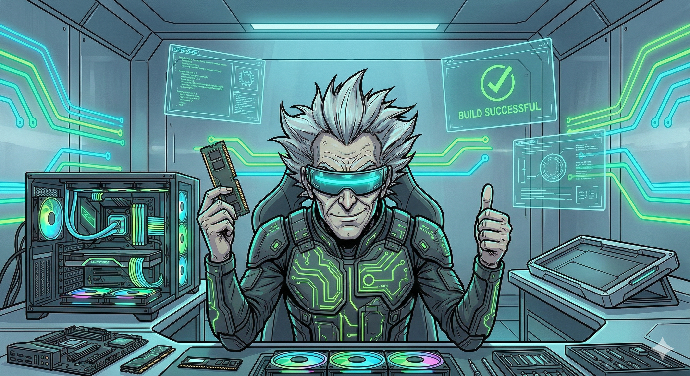

# PC Architect

A little game I built for fun: you get a budget, a mission, and a ticking timer — now go build a PC that doesn't explode.

Your guide is **Walter**, a slightly unhinged mad-scientist hardware expert who will roast your build choices without mercy (powered by Gemini, so the roasts are fresh every time).


## Meet Walter

| Approves your build | Judging you | Something exploded |
|:---:|:---:|:---:|
|  |  |  |

## How to Play

1. **Pick a mission** — Office (CHF 600), Gaming (CHF 1500), or Workstation (CHF 2500)
2. **Build your PC** — CPU, GPU, RAM, mainboard, PSU, SSD, cooler, case
3. **Don't mess up** — real-time compatibility checks: socket match, RAM type, PSU wattage, GPU length, cooler height...
4. **Face Walter** — he scores your build from A to D and roasts your worst decision

Beat the timer, stay on budget, and maybe — *maybe* — Walter gives you a thumbs up.

After every build you also get:

- **Estimated FPS** for CS2, Fortnite, GTA V, Cyberpunk 2077 and Minecraft, based on your parts
- **Achievements** — from "Walter's Favorite" (score 90+) to "Fire Hazard" (your PSU is crying)
- **Confetti** if you somehow earn an A. Walter will deny being proud of you.

## Run It Yourself

```bash
git clone https://github.com/VanyaCherneha/PC-Architect.git
cd PC-Architect
npm install

# optional: give Walter a brain
cp .env.example .env
# put your Google Gemini API key into .env

npm run dev
```

Open [http://localhost:5173](http://localhost:5173) and start building.

No API key? No problem — Walter falls back to canned (but still judgmental) feedback.

> **Note:** The Gemini key is used client-side, so don't deploy this with a key you care about. It's a toy, not a bank.

## Tech

- **React 18** + **Vite**
- **React Router** + **Context API**
- **i18next** — English & German
- **Google Gemini** for Walter's AI roasts
- Plain CSS, cyberpunk comic-book style

## Structure

```
src/
├── assets/images/     # Backgrounds and Walter's many moods
├── components/        # UI bits (BudgetBar, ComponentCard, Walter, ...)
├── pages/             # ScenarioSelect -> Configurator -> Results
├── context/           # GameContext (global state)
├── data/              # components.json (the hardware "database")
└── utils/             # Compatibility checker logic
```

## License

MIT — do whatever you want with it. Walter doesn't judge. (He does.)
